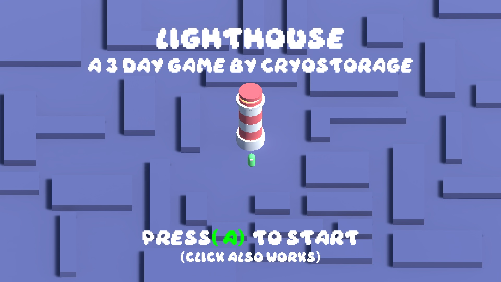

##  Game Engine Specialization - Unity
Repository created for the 8th semester game engine specialization course.

## Contains:

### Sim Game

  A simple game where you can chose and customize a character and then walk around a small town.

### Lighthouse Game
  A simple tower defense game that was created in 3 days as a challenge.
  
  playable in browser at: https://cryostorage.itch.io/lighthouse

> Architecture centers around unity events run through scriptable objects.
> Which makes it easy to modify existing behaviours and create new ones with minimal code.  
  
